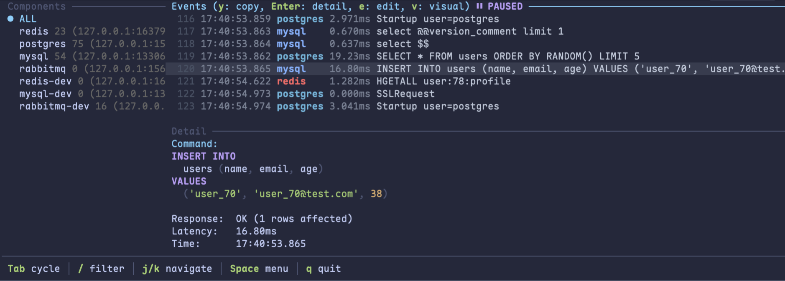

# Ocular

A TUI tool for real-time visualization of middleware traffic. See exactly what your services send to Redis, MySQL, PostgreSQL, RabbitMQ, Elasticsearch — regardless of programming language.

 



## How It Works

Ocular runs lightweight TCP proxies between your application and middleware. Traffic flows through transparently while Ocular parses the wire protocol and displays structured events in a terminal dashboard.

```
Your App ──→ Ocular Proxy (16379) ──→ Redis (6379)
                    │
              TUI Dashboard
```

**Zero code changes.** Just point your app's connection to the proxy port.

## Features

- **Real-time event stream** — watch requests/responses as they happen
- **Protocol parsing** — human-readable commands instead of raw bytes
- **Latency tracking** — request→response timing for every operation
- **Filtering** — search by component name or keyword (`/` to activate)
- **Component selection** — focus on a single middleware in the left panel
- **Detail inspector** — select any event to see full payload (scrollable)
- **MySQL ResultSet display** — parsed columns and rows instead of binary
- **Auto SSL stripping** — MySQL connections work without `--ssl-mode=DISABLED`
- **Local timezone** — timestamps match your system clock
- **Vim-style navigation** — `gg`, `G`, `Ngg` line jumps
- **Visual selection** — select multiple events, copy or open in editor
- **Yank to clipboard** — `y` copies command/SQL to system clipboard
- **Open in $EDITOR** — `e` opens selected commands in vim/nvim
- **Language agnostic** — works with Java, Rust, Go, Python, anything

## Supported Protocols

| Protocol | Status |
|----------|--------|
| Redis (RESP) | ✅ |
| MySQL | ✅ |
| PostgreSQL | ✅ |
| RabbitMQ (AMQP) | ✅ |
| MongoDB | ✅ |
| HTTP / Elasticsearch | ✅ |

## Quick Start

### Install

```bash
curl -fsSL https://raw.githubusercontent.com/beyondlex/ocular/main/install.sh | sh
```

### Build from source

```bash
cargo build --release
```

### Configuration

Ocular looks for `ocular.toml` in the following order:

1. `./ocular.toml` (current directory)
2. `$XDG_CONFIG_HOME/ocular/ocular.toml`
3. `~/.config/ocular/ocular.toml`

```toml
[[proxy]]
name = "redis"
protocol = "redis"
listen = "127.0.0.1:16379"
remote = "127.0.0.1:6379"

[[proxy]]
name = "mysql"
protocol = "mysql"
listen = "127.0.0.1:13306"
remote = "127.0.0.1:3306"

[[proxy]]
name = "postgres"
protocol = "postgres"
listen = "127.0.0.1:15432"
remote = "127.0.0.1:5432"

[[proxy]]
name = "mongodb"
protocol = "mongodb"
listen = "127.0.0.1:17017"
remote = "127.0.0.1:27017"
```

Multiple instances of the same protocol are supported — just use different names and ports:

```toml
[[proxy]]
name = "redis-cache"
protocol = "redis"
listen = "127.0.0.1:16379"
remote = "127.0.0.1:6379"

[[proxy]]
name = "redis-session"
protocol = "redis"
listen = "127.0.0.1:16380"
remote = "127.0.0.1:6380"
```

```bash
# Run
./target/release/ocular

# Connect your app to the proxy ports
redis-cli -h 127.0.0.1 -p 16379
mysql -h 127.0.0.1 -P 13306 -u root -p
```

> **Note:** For MySQL, use `-h 127.0.0.1` (not `localhost`) to ensure TCP connection through the proxy.

## Event Filtering (Exclude / Include)

Hide noisy events from the Events panel using `exclude` rules. Use `include` to override excludes and force specific events to remain visible.

### Global exclude (by protocol)

Apply to all proxies of a given protocol:

```toml
[exclude.redis]
patterns = ["PING", "INFO"]

[exclude.rabbitmq]
patterns = ["Heartbeat"]
case_sensitive = true

[exclude.mysql]
patterns = ["SELECT 1"]
```

### Per-proxy exclude

Override the global rule for a specific proxy:

```toml
[[proxy]]
name = "mysql-dev"
protocol = "mysql"
listen = "127.0.0.1:13306"
remote = "127.0.0.1:3306"
[proxy.exclude]
patterns = ["^SELECT 1$", "^PING$"]
regex = true
case_sensitive = false
```

When a `[[proxy]]` has its own `[proxy.exclude]`, it is **merged** with the global `[exclude.<protocol>]` — both sets of patterns apply. Use `[proxy.include]` to selectively override specific patterns.

### Include (override exclude)

Force events to be shown even if they match an exclude rule:

```toml
[exclude.redis]
patterns = ["PING", "INFO", "SUBSCRIBE"]

[[proxy]]
name = "redis-debug"
protocol = "redis"
listen = "127.0.0.1:16380"
remote = "127.0.0.1:6380"
# Inherits global exclude, but force-shows PING
[proxy.include]
patterns = ["PING"]
```

Evaluation order: **include match → show** > **exclude match → hide** > **default → show**

### Options

| Field | Default | Description |
|-------|---------|-------------|
| `patterns` | (required) | List of strings to match against the event command |
| `case_sensitive` | `false` | Whether matching is case-sensitive |
| `regex` | `false` | Treat patterns as regular expressions |

## Event Line Format

Customize how each event line is displayed using a template string:

```toml
event_format = "%{5}index %time [%{-12}component] %command (%latency)"
```

### Syntax

- `%field` — insert field value
- `%{N}field` — fixed width of N characters (positive = right-aligned, negative = left-aligned)
- All other characters are literal

### Available Fields

| Field | Content |
|-------|---------|
| `index` | Line number |
| `time` | Timestamp (local timezone) |
| `component` | Component name |
| `command` | Event command/SQL |
| `latency` | Request→response duration |
| `src` | Source address (ip:port) |
| `dest` | Destination address (ip:port) |
| `process` | Client process info |

### Examples

```toml
# Default
event_format = "%{5}index %time [%{-12}component] %command (%latency)"

# Compact — no line number
event_format = "%time %{-10}component %command (%latency)"

# Minimal — command only
event_format = "[%{-10}component] %command"
```

> This setting supports hot-reload — save the config and the format updates immediately.

## Keybindings

| Key | Action |
|-----|--------|
| `j` / `k` | Navigate events / scroll detail |
| `gg` | Jump to first event |
| `G` | Jump to last event |
| `Ngg` | Jump to event N (e.g. `42gg`) |
| `Tab` / `Shift+Tab` | Cycle focus: Components → Events → Detail |
| `/` | Enter filter mode (match component or command) |
| `Enter` | Confirm filter / select component |
| `Esc` | Clear filter or component selection |
| `v` | Toggle visual (multi-line) selection |
| `y` | Copy selected command(s) to clipboard |
| `e` | Open selected command(s) in `$EDITOR` |
| `Space` | Open leader menu (see below) |
| `q` | Quit |

### Leader Menu (Space)

Press `Space` to open a floating command palette:

| Key | Action |
|-----|--------|
| `h` | Jump Left |
| `j` | Jump Down |
| `k` | Jump Up |
| `l` | Jump Right |
| `c` | Clear all events |

## Architecture

```
crates/
├── ocular/            # Binary entry point, config loading
├── ocular-protocol/   # Wire protocol parsers (RESP, MySQL)
├── ocular-proxy/      # Async TCP proxy with event broadcasting
└── ocular-tui/        # Terminal UI (ratatui)
```

## Logging

Logs are written to `ocular.log` in the working directory (not to stdout, to avoid interfering with the TUI). Control verbosity with `RUST_LOG`:

```bash
RUST_LOG=debug ./target/release/ocular
```

## Event Log

Record all proxy events to `events.log` (same directory as `ocular.log`) for offline analysis:

```toml
[event_log]
enabled = true
include_response = true
components = ["redis-cache", "mysql"]
```

| Field | Default | Description |
|-------|---------|-------------|
| `enabled` | `true` (when section present) | Enable/disable event logging |
| `include_response` | `false` | Append response after the command |
| `components` | `[]` (all) | Only log events from these component names |

Output format:

```
21:08:43.123 [redis-cache] SET user:1 "hello" (0.45ms) -> OK
21:08:43.456 [mysql] SELECT * FROM users (1.23ms) -> ResultSet (19 rows, 3 cols)
```

Without `include_response`, the `-> ...` part is omitted.

## License

MIT
