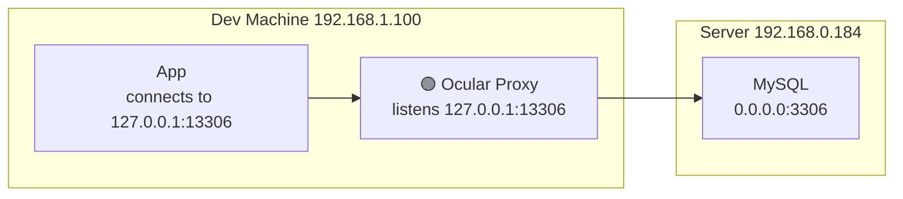
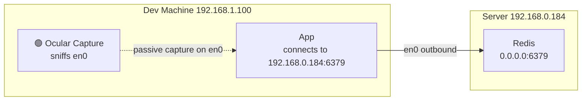
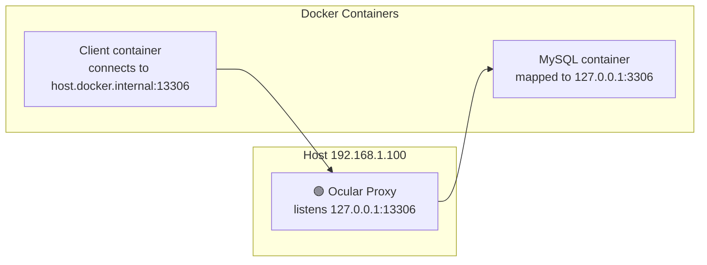
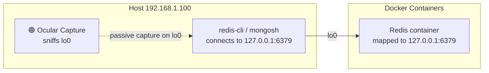
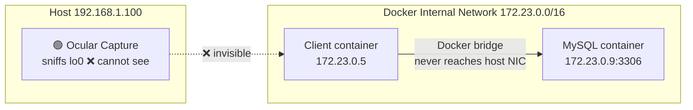
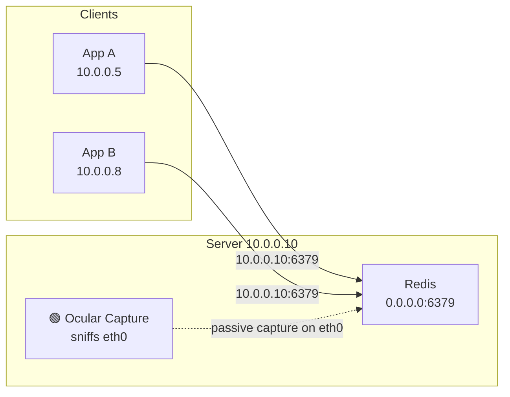
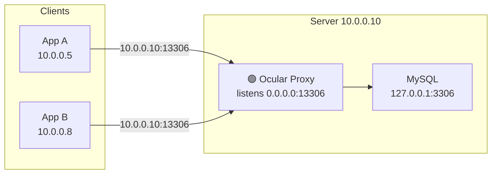
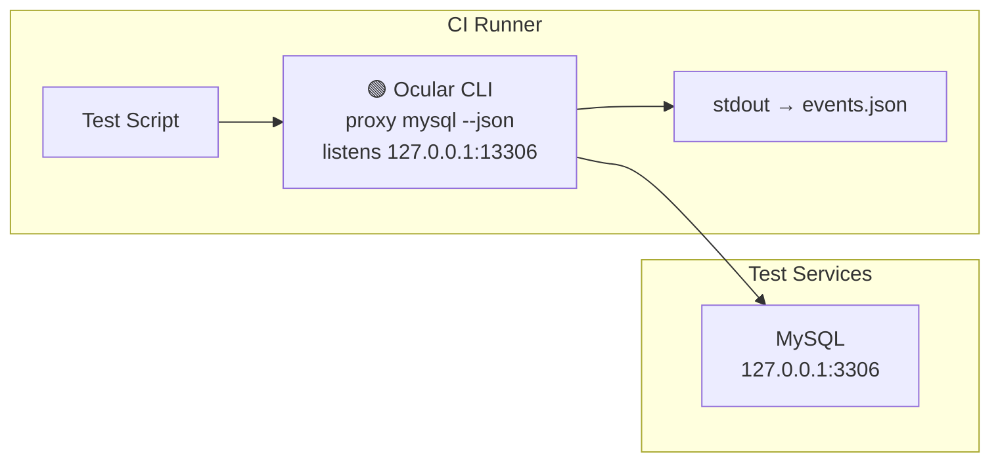
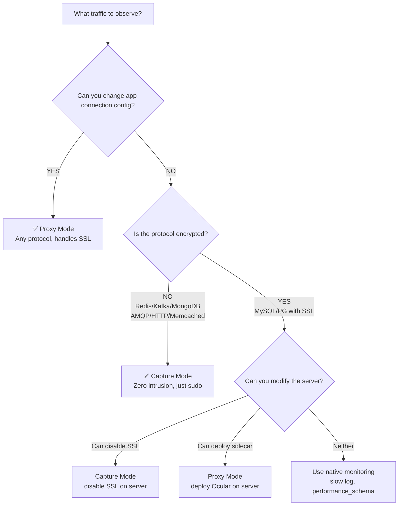

# Usage Scenarios

## 1. Local Development — Proxy Mode

Ocular runs on: **Dev machine (192.168.1.100)**



**CLI:**
```bash
ocular proxy mysql 192.168.0.184
# Listens on 127.0.0.1:13306, forwards to 192.168.0.184:3306
```

**Config (ocular.toml):**
```toml
[[proxy]]
name = "mysql-dev"
protocol = "mysql"
listen = "127.0.0.1:13306"
remote = "192.168.0.184:3306"
```

> ✅ Auto SSL stripping | Requires changing app connection to `127.0.0.1:13306`

---

## 2. Local Development — Capture Mode

Ocular runs on: **Dev machine (192.168.1.100)**



**CLI:**
```bash
sudo ocular capture redis 192.168.0.184 -i en0
# Captures Redis traffic on en0 to 192.168.0.184:6379
```

**Config (ocular.toml):**
```toml
[[proxy]]
name = "redis-dev"
protocol = "redis"
mode = "capture"
interface = "en0"
remote = "192.168.0.184:6379"
```

> ❌ Cannot decrypt SSL traffic | Zero config on app side, requires sudo

---

## 3. Docker Compose — Proxy Mode

Ocular runs on: **Host machine (192.168.1.100)**



**CLI:**
```bash
ocular proxy mysql 127.0.0.1:3306 -l 127.0.0.1:13306
```

**Config (ocular.toml):**
```toml
[[proxy]]
name = "mysql"
protocol = "mysql"
listen = "127.0.0.1:13306"
remote = "127.0.0.1:3306"
```

**Docker client env:**
```yaml
environment:
  MYSQL_HOST: host.docker.internal
  MYSQL_PORT: 13306
```

> ✅ Auto SSL stripping | Docker service must map port to host (`ports: "3306:3306"`)

---

## 4. Docker Services — Capture Mode

Ocular runs on: **Host machine (192.168.1.100)**



**CLI:**
```bash
sudo ocular capture redis 127.0.0.1 -i lo0    # macOS
sudo ocular capture redis 127.0.0.1 -i lo     # Linux
```

**Config (ocular.toml):**
```toml
[[proxy]]
name = "redis"
protocol = "redis"
mode = "capture"
interface = "lo0"            # macOS: lo0, Linux: lo
remote = "127.0.0.1:6379"
```

> Note: Traffic between containers (not routed through host NIC) is invisible to capture



> This traffic stays inside the Docker VM (macOS) or bridge network (Linux) and never passes through the host's lo0/eth0.

---

## 5. Production Server — Capture Mode

Ocular runs on: **Server (10.0.0.10)**



**CLI:**
```bash
sudo ocular capture redis 10.0.0.10:6379 -i eth0
# Or auto-detect interface:
sudo ocular capture redis 10.0.0.10
```

**Config (ocular.toml):**
```toml
[[proxy]]
name = "redis-prod"
protocol = "redis"
mode = "capture"
interface = "eth0"
remote = "10.0.0.10:6379"
```

**Permission (persistent, no sudo needed after this):**
```bash
sudo setcap cap_net_raw+ep $(which ocular)
```

> Shows all client IPs in `src` field | Zero intrusion | ❌ Cannot decrypt SSL traffic

---

## 6. Production Server — Proxy Mode (Sidecar)

Ocular runs on: **Server (10.0.0.10)**



**CLI:**
```bash
ocular proxy mysql 127.0.0.1:3306 -l 0.0.0.0:13306
```

**Config (ocular.toml):**
```toml
[[proxy]]
name = "mysql-prod"
protocol = "mysql"
listen = "0.0.0.0:13306"
remote = "127.0.0.1:3306"
```

> ✅ Auto SSL stripping | Clients must connect to :13306 instead of :3306

---

## 7. CI Automation — CLI Mode

Ocular runs on: **CI Runner**



**Commands:**
```bash
# Start proxy in background, output JSON
ocular proxy mysql --json > events.json &

# Run tests (connecting to 127.0.0.1:13306)
pytest --db-port=13306

# Analyze captured events
cat events.json | jq '.command'
```

---

## Decision Flowchart


